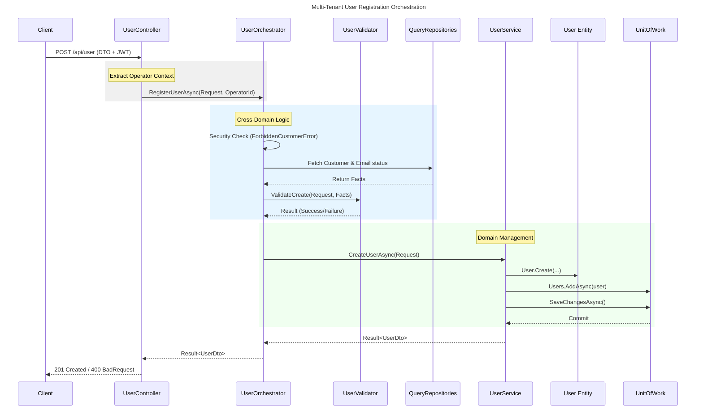

# Folder Structure

## Overview
This project follows a **modular architecture** based on **Clean Architecture** principles. Clean Architecture is a software design philosophy that emphasizes separation of concerns, making systems more testable, maintainable, and independent of external frameworks. The core idea is to organize code into layers where dependencies flow inward, from outer layers (like UI and infrastructure) to inner layers (like business logic and domain).

In a modular system, the application is divided into self-contained modules, each handling a specific business domain (e.g., IAM for Identity and Access Management). This promotes scalability and allows teams to work on different modules independently.

## Root Level Structure
- `create-module.ps1` and `create-module-shared.ps1`: Scripts to scaffold new modules or shared libraries.
- `IAM/`: The IAM (Identity and Access Management) module.
- `Shared/`: Common utilities packaged as NuGet packages for reuse across modules.

## IAM Module Structure
The IAM module is organized into the following layers:

### `src/`
Contains the source code, divided into projects:

- **`IAM.API/`**: The outermost layer, containing the Web API controllers and configuration. This layer depends on all inner layers and exposes endpoints for client interactions.
  - `Configure/`: Dependency injection configuratios.
  - `Controllers/`: API controllers like `UserController`, `CustomerController`.
  - `Middlewares/`: Custom middleware for error handling, logging, etc.
  - `Program.cs`: Application entry point with ASP.NET Core setup.
  - `appsettings.json`: Configuration files.

- **`IAM.Domain/`**: The innermost layer containing domain entities, value objects, and interfaces. This layer is independent of any external frameworks and represents the core business rules and data structures.
  - `Customer.cs`, `User.cs`: Domain entities.
  - `DTOs/`: Data Transfer Objects for requests and responses.
  - `Repositories/`: Interfaces for data access (e.g., `IUserRepository`).
  - `QueryRepositories/`: Interfaces for read-only queries (e.g., `IUserQueryRepository`).

- **`IAM.Application/`**: Contains application logic, services, and use cases. This layer orchestrates business operations and depends only on the Domain layer.
  - `Contracts/`: Interfaces for services and repositories.
  - `Extensions/` : Extension methods for service registration and other utilities. 
  - `Services/`: Business services like `UserService`, `AuthService`.
  - `Orchestrators/`: For services that coordinate multiple domain entities or operations across domains (e.g., `UserOrchestrator`).
  - `Validators/`: Validation logic for entities and operations.

- **`IAM.Infrastructure/`**: Handles external concerns like databases, APIs, and third-party services. This layer implements interfaces defined in Domain and Core.
  - `IamDbContext.cs`: Entity Framework DbContext for database interactions.
  - `Migrations/`: Database migration files.
  - `Repositories/`: Implementations of repository interfaces.
  - `QueryRepositories/`: Implementations for query operations.

### `tests/`
- **`IAM.Application.Tests/`**: Unit tests for the Application layer, ensuring business logic correctness.

### `docs/`
- Documentation files (this file and others).

## Dependency Flow
Dependencies flow inward:
- API → Application → Infrastructure → Domain
- Infrastructure implements Domain interfaces.
- Core uses Domain abstractions.
- API uses Core services.

### Summary of the Flow
Controller receives the request and identifies the Operator.

Orchestrator gathers data from QueryRepositories (e.g., checks if the Tenant exists).

Validator checks the DTO against the gathered data and business rules.

UserService invokes the Domain Entity to modify state (e.g., hashing a password).

Unit of Work saves the changes to the database.

This chain ensures that no class is overloaded with responsibility, making the software easier to document, test, and maintain.

### The Request Chain and Class Responsibilities: an example using User Management
The execution flow for a typical request, such as creating a user or updating a password, follows this sequence:

#### 1. UserController (The Entry Point)
The Controller is responsible for handling HTTP communication. It defines the API endpoints, handles routing, and extracts data from the request (Body, Query, or Identity Claims).

Purpose: To map HTTP requests to specific application actions.

Role: It should remain "thin," performing no business logic. Its main job is to extract the Operator's Context (like the operatorCustomerId from the JWT) and **pass the DTO to the Orchestrator or Service**.

#### 2. UserOrchestrator (The Coordinator)
The Orchestrator acts as a "Maestro" for operations that cross domain boundaries. For example, creating a user requires checking if a Customer exists and if the User's email is unique.

Purpose: To coordinate logic between different domains (User and Customer) and enforce high-level security rules, such as ForbiddenCustomerError.

Role: It fetches necessary data from various repositories to prepare a "complete picture" for validation.

#### 3. UserService (The Domain Manager)
The Service manages the lifecycle of the primary entity. Once the Orchestrator has validated the cross-domain requirements, the Service performs the specific entity actions.

Purpose: To encapsulate application logic specific to the User entity.

Role: It interacts with the Unit of Work to persist changes. It calls the User domain entity methods (like UpdatePassword) to ensure state changes are handled correctly according to Domain-Driven Design (DDD) principles.

#### 4. UserValidator (The Logic Filter)
The Validator is a pure, stateless class that evaluates the validity of a request against the current state of the system.

Purpose: To centralize business rules and prevent invalid data from reaching the database.

Role: It receives the request DTO and "facts" provided by the Orchestrator (e.g., emailExists, customerExists) and returns a Result object containing success or failure messages.

#### 5. Repositories and Unit of Work (The Data Access)
These classes handle the actual communication with the database. We distinguish between QueryRepositories (optimized for read operations) and Repositories (for write operations).

Purpose: To abstract the persistence mechanism (EF Core/SQL).

Role: The Repository performs the CRUD operations, while the Unit of Work ensures that all changes in a single transaction are committed together.

## Shared Module
- `src/Shared/`: Common utilities as a NuGet package.
- `tests/Shared.Tests/`: Tests for shared components.

This setup allows for easy extension with new modules following the same pattern.